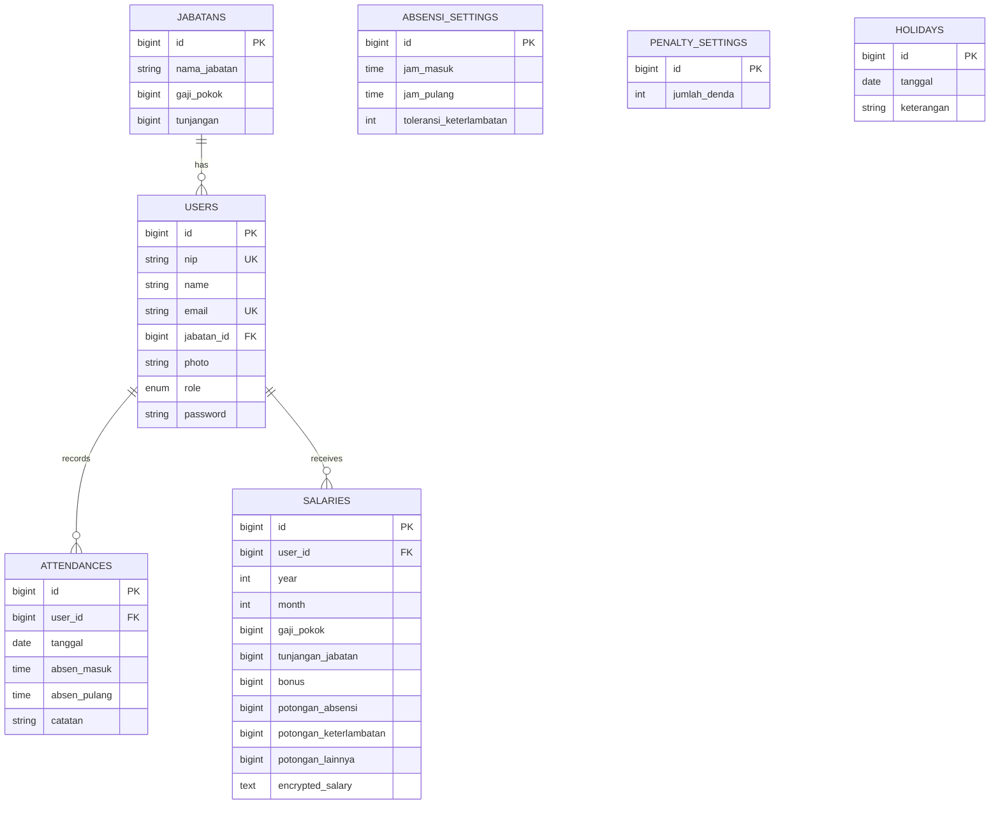

# HadirGaji - Sistem Absensi & Penggajian Karyawan Berbasis Laravel 💼

Sistem manajemen absensi dan penggajian berbasis Laravel untuk memantau kehadiran, menghitung gaji bulanan, dan mengelola data karyawan dengan aman.

## Daftar Isi 📚

- [Deskripsi Proyek](#deskripsi-proyek-)
- [Prasyarat](#prasyarat-)
- [Instalasi](#instalasi-)
- [Penggunaan](#penggunaan-)
- [Bahasa Pemrograman & Library](#bahasa-pemrograman--library-)
- [Struktur Database](#struktur-database-)
- [Role & Fitur](#role--fitur-)
- [Kontribusi](#kontribusi-)
- [Lisensi](#lisensi-)

## Deskripsi Proyek 🧭

HadirGaji adalah proyek portfolio sistem absensi dan penggajian karyawan berbasis Laravel, dengan fokus pada:

- Manajemen master data: jabatan, karyawan, hari libur, pengaturan absensi, dan denda keterlambatan.
- Pencatatan absensi harian (masuk/pulang) baik manual maupun scan QR.
- Perhitungan gaji bulanan berdasarkan kehadiran, keterlambatan, bonus, dan potongan.
- Enkripsi nilai total gaji untuk menjaga kerahasiaan data payroll.
- Ekspor laporan penggajian ke PDF.

## Prasyarat ✅

- PHP >= 8.2
- Composer >= 2.x
- Node.js >= 18.x
- NPM >= 9.x
- MySQL / MariaDB
- Web server lokal (disarankan: Laragon/XAMPP) atau `php artisan serve`

## Instalasi ⚙️

1. Clone repository.

```bash
git clone <url-repository>
cd app_absensipengggajianv1
```

2. Install dependency backend (PHP).

```bash
composer install
```

3. Install dependency frontend (Vite).

```bash
npm install
```

4. Siapkan environment.

```bash
cp .env.example .env
php artisan key:generate
```

5. Atur koneksi database pada file `.env` (contoh default lokal):

```env
DB_CONNECTION=mysql
DB_HOST=127.0.0.1
DB_PORT=3306
DB_DATABASE=db_absensikaryawanv1
DB_USERNAME=root
DB_PASSWORD=
```

6. Jalankan migrasi dan seeder.

```bash
php artisan migrate --seed
```

7. Jalankan aplikasi.

```bash
php artisan serve
npm run dev
```

## Penggunaan 🚀

1. Buka aplikasi di browser:

```text
http://127.0.0.1:8000
```

2. Login menggunakan akun hasil seeder:

- Admin:
    - Email: `john@example.com`
    - Password: `password`
- Karyawan:
    - Email: `jane@example.com`
    - Password: `password`

3. Alur kerja utama:

- Admin mengatur `Jabatan`, `Karyawan`, `Setting Absensi`, `Hari Libur`, dan `Denda`.
- Karyawan melakukan `Absen Masuk/Pulang` (manual atau scan QR).
- Admin melakukan proses `Penggajian` bulanan dan dapat mengunduh PDF.
- Karyawan melihat riwayat gaji pribadi pada menu `Penggajian`.

## Bahasa Pemrograman & Library 🛠️

### Bahasa dan framework utama

- PHP 8.2
- Laravel 11
- JavaScript (ES Module) + Vite 5
- Blade Template (server-side rendering)
- SQL (MySQL/MariaDB)

### Library/dependency backend

- `laravel/framework` (framework utama)
- `laravel/tinker` (debug/repl)
- `endroid/qr-code` (generate QR Code)
- `mpdf/mpdf` (generate PDF laporan gaji)
- `nesbot/carbon` (manipulasi tanggal/waktu, via Laravel)

### Library/dependency frontend

- `vite`, `laravel-vite-plugin`
- `axios`
- AdminLTE (template dashboard)
- Bootstrap 4
- jQuery
- DataTables + plugins (export CSV/Excel/PDF/Print)
- Font Awesome
- `html5-qrcode` (scan QR dari browser, via CDN)

## Struktur Database 🗄️

Entity utama proyek:

- `jabatans`: master jabatan, gaji pokok, tunjangan.
- `users`: data akun pengguna (admin/karyawan), terhubung ke jabatan.
- `attendances`: catatan absensi harian (masuk/pulang/catatan).
- `absensi_settings`: jam kerja dan toleransi keterlambatan.
- `penalty_settings`: denda per menit keterlambatan.
- `holidays`: daftar tanggal libur.
- `salaries`: komponen gaji bulanan + nilai total terenkripsi.

Relasi kunci:

- `users.jabatan_id -> jabatans.id`
- `attendances.user_id -> users.id`
- `salaries.user_id -> users.id`

Ringkasan ERD:



## Role & Fitur 👥

### 1) Admin

- Dashboard statistik (jumlah karyawan/admin/jabatan, rekap absen hari ini).
- CRUD Data Jabatan.
- CRUD Data Karyawan + upload foto.
- Generate dan download QR Code untuk absensi karyawan.
- CRUD Setting Absensi (jam masuk, jam pulang, toleransi).
- CRUD Setting Hari Libur.
- CRUD Setting Denda Keterlambatan.
- Lihat data absensi per bulan/tahun (dapat filter karyawan).
- Kelola penggajian bulanan (create/edit), hitung potongan otomatis, ekspor PDF.
- Kelola profil akun dan logout.

### 2) Karyawan

- Dashboard absensi harian (absen masuk/pulang).
- Scan QR untuk absen masuk/pulang.
- Lihat data absensi pribadi per bulan/tahun.
- Lihat data gaji pribadi (hasil dekripsi `encrypted_salary`).
- Kelola profil akun dan logout.

### Catatan aturan bisnis

- Keterlambatan dihitung berdasarkan `jam_masuk` dan `toleransi_keterlambatan`.
- Hari libur + weekend dapat ditandai sebagai `Lembur` pada catatan absensi.
- Potongan absensi dihitung proporsional berdasarkan ketidakhadiran pada hari kerja.
- Potongan keterlambatan dihitung per menit sesuai `jumlah_denda`.

## Kontribusi 🤝

Kontribusi sangat terbuka. Agar konsisten, ikuti alur berikut:

1. Fork repository.
2. Buat branch fitur/perbaikan.

```bash
git checkout -b feat/nama-fitur
```

3. Lakukan perubahan dengan commit yang jelas.

```bash
git commit -m "feat: menambahkan fitur X"
```

4. Jalankan pengecekan lokal sebelum push.

```bash
php artisan test
```

5. Push branch dan ajukan Pull Request.

```bash
git push origin feat/nama-fitur
```

## Lisensi 📄

Proyek ini saat ini mengikuti lisensi MIT (mengacu pada konfigurasi proyek Laravel di `composer.json`).

Jika Anda ingin lisensi khusus proyek, tambahkan file `LICENSE` agar ketentuan hukum lebih eksplisit.
